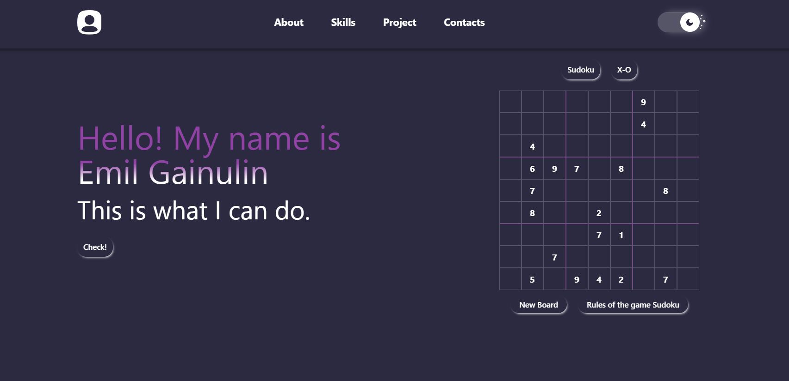

# Portfolio 

## Это мой персональный сайт-портфолио, где представлена основная информация обо мне, моих навыках и проектах.



## Стек технологий:
<div>
  
  
  
  
  
  
  
  
  
  
  
  
</div>

## Цель проекта:
- Создание современного, адаптивного портфолио для демонстрации моих навыков разработки на React и TypeScript, а также практики работы с библиотекой Ant Design и сборщиком Vite.

## Как запустить проект?
```bash

# Скопировать проект
git clone https://github.com/HELLRAID-cmd/Portfolio.git

# Перейти в папку client
cd client

# Установить зависимости
npm i

# Запустить проект
npm run dev
```
## Адаптивность:
Проект оптимизирован под мобильные устройства.
Минимальная комфортная ширина просмотра — 360px.

## Связаться со мной:
<a href="https://t.me/HELLRAD1" target="_blank">
  
</a>
<a href="mailto:emilgainulinjob@gmail.com" target="_blank">
  
</a>
